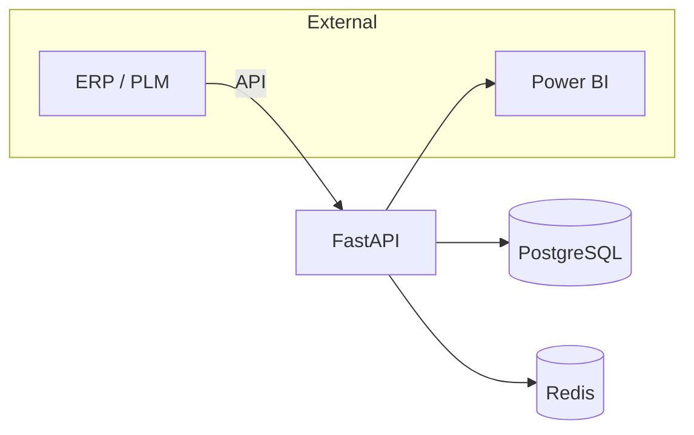

*(Référence d’intégration pour développeurs internes / partenaires)*

# 04‑API & Data

## 1. Principes généraux
- API **RESTful** (JSON over HTTP, stateless, resource‑oriented).
- Versionnage dans l’URL : `/v1/` (breaking change → `/v2/`).
- Authentification : **JWT** Azure AD (OIDC) pour les utilisateurs humains, **PAT** (Personal Access Token) pour les intégrations service‑to‑service.
- Toutes les réponses sont UTF‑8, `Content‑Type: application/json; charset=utf-8`.

---

## 2. Base URLs
| Environnement | URL racine |
|---------------|-----------|
| **Staging** | `https://dmp-staging.api.example.com/v1/` |
| **Production** | `https://dmp.api.example.com/v1/` |

---

## 3. Auth & Headers standards
```http
Authorization: Bearer <jwt>
X-Request-ID: <uuid4>   # pour le tracing
Accept: application/json; charset=utf-8
````

---

## 4. Ressources principales

| Verbe    | Endpoint                   | Description                                     |
| -------- | -------------------------- | ----------------------------------------------- |
| **POST** | `/imports`                 | Uploader un fichier prévisions (.xlsx ou .csv). |
| **GET**  | `/snapshots/{id}`          | Récupérer le snapshot validé (métier).          |
| **POST** | `/scenarios/{id}/simulate` | Lancer la **simulation S\&OP** d’un scénario.   |
| **GET**  | `/kpi`                     | KPIs agrégés (filtres : période, canal).        |
| **GET**  | `/reference/sku`           | Catalogue produits (SKU, libellé, famille).     |

La documentation interactive Swagger est disponible sur `/docs`.

---

## 5. Modèles JSON (extraits)

### 5.1 ForecastLine

```json
{
  "sku": "BRA-123-BLK-S",
  "client": "E-COM",
  "period": "2025-10",
  "qty": 1200,
  "price": 19.9
}
```

### 5.2 ScenarioAssumption

```json
{
  "leadTime": 90,
  "markdownPct": -10,
  "volBoostPct": 5
}
```

---

## 6. Pagination & Filtres

* Pagination **cursor‑based** : `?cursor=<opaque_id>&limit=100` (max = 500).
* Filtres communs : `client`, `sku`, `period_from`, `period_to`.

---

## 7. Gestion des erreurs (format commun)

```json
{
  "error": {
    "code": "VALIDATION_ERROR",
    "message": "Duplicate (client, sku, period)",
    "details": { "line": 42 }
  }
}
```

* Codes HTTP : **400**, 401, 403, 404, **422**, 429, 500.

---

## 8. Webhooks sortants

| Événement            | Endpoint example  | Payload résumé               |
| -------------------- | ----------------- | ---------------------------- |
| `forecast.validated` | POST → URL config | Snapshot ID, user, timestamp |
| `scenario.published` | POST → URL config | Scenario ID, KPI, delta      |
| `import.failed`      | POST → URL config | filename, error list         |

> Tous les webhooks sont signés HMAC SHA‑256 (header `X‑DMP‑Signature`).

---

## 9. Import / Export

* **Import** : Excel `*.xlsx` (onglet `Forecast`) ou CSV UTF‑8. Le fichier doit contenir les colonnes : `sku, client, period, qty, price`.
* **Export** : CSV, Excel, ou **NDJSON** (streaming) pour gros volumes.

---

## 10. Data Flow (haut‑niveau)



---

## 11. Versioning & Dépréciation

* Ajout de champs ⇒ **compatibilité ascendante** (pas de nouvelle version).
* Breaking change ⇒ nouvelle URL `/vX/` + header HTTP `Deprecation: <date>` (minimum 90 jours de chevauchement).

---

## 12. Gouvernance des données

| Rôle          | Nom             | Responsabilité                         |
| ------------- | --------------- | -------------------------------------- |
| **Owner**     | Demand Planning | Définir les règles métier & priorités. |
| **Steward**   | Data Engineer   | Qualité, catalogage, lineage.          |
| **Custodian** | IT              | Sécurité, backups, performance.        |

Tests de qualité nightly via **dbt** (`dbt test`).

---

## 13. Prochaines actions

| # | Tâche                                       | Responsable   | Échéance      |
| - | ------------------------------------------- | ------------- | ------------- |
| 1 | Rédiger le JSON Schema complet              | Data Engineer | 25 août 2025  |
| 2 | Mettre en place tests contractuels **Pact** | Backend       | 1ᵉʳ sept 2025 |
| 3 | Publier guide webhooks détaillé             | Tech Writer   | 3 sept 2025   |
